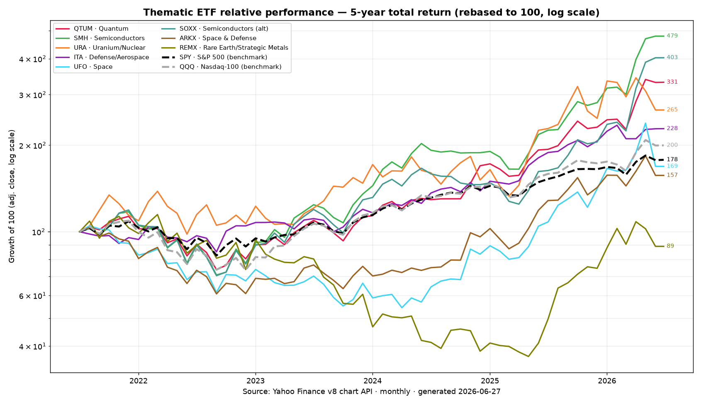
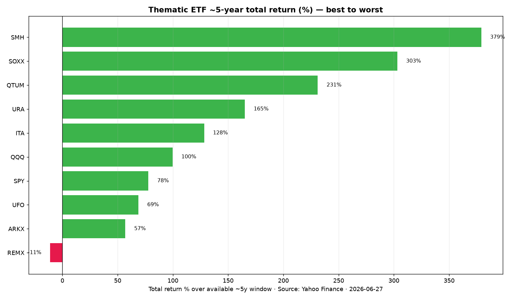

# Watchlists & Fundamentals — by ETF data pool

*Companion to [`STOCK_THEME_TRENDS_TRACKER.md`](./STOCK_THEME_TRENDS_TRACKER.md) · Compiled 2026-06-27*

This file adds (1) a **5-year relative-performance chart** across the themes using common ETFs as
data pools, and (2) a **watchlist per ETF** with fundamentals for the constituent companies —
**EPS growth, P/E, forward P/E, margins, and backlog**.

> **Data caveats (important).**
> - **Chart/ETF returns** are computed from Yahoo Finance monthly **adjusted-close** data
>   (2021-06 → 2026-06), so they are total returns (incl. distributions). The "5y" window is the
>   ~5 years of available monthly data.
> - **Fundamentals** are pulled from public aggregators (mostly **stockanalysis.com**) and company
>   IR/SEC filings, as of ~2026-06-26/27. TTM = trailing twelve months. Figures marked **"approx"**
>   are directional; **"N/A (neg)"** means a P/E is not meaningful because earnings are negative;
>   **"n/r"** means no formal backlog is reported.
> - Many momentum names (quantum, micro-cap drones, junior rare earths, pre-revenue SMRs) are
>   **loss-making** — their valuation rests on growth/option value, not earnings. Several TTM figures
>   (WDC/SNDK post-spin, ONDS, PDYN, PL) are **distorted by one-time items** and are flagged.
> - **Not investment advice.**

---

## 1) 5-year relative performance — thematic ETFs

Common, liquid ETFs are used as **data pools** for each theme. Note that **memory, photonics, and
drones lack a clean ≥5-year pure-play ETF**, so they are proxied (memory → SOXX/SMH; photonics →
SMH/SOXX; drones → ITA/defense, with newer pure-plays UAV/DRNZ/SHLD too short for a 5y series).

### 🖱️ Interactive version → [`assets/interactive_etf_chart.html`](./assets/interactive_etf_chart.html)

A self-contained interactive chart (open it in a browser — it won't render in GitHub's file
preview; **download the file and open it**, or serve the repo via GitHub Pages):

- **Adjustable start point** — drag the start-date slider (or use 1M / 3M / 6M / 1Y / 2Y / 3Y / YTD /
  Max presets) to rebase every line to 100 at any day and isolate **short-term relative trends**.
- **Clickable news nodes** — ◆ diamonds sit on the lines at key catalysts; click a diamond (or a
  catalyst card below the chart) to highlight the event. 32 curated catalysts are mapped to their ETF.
- **Deep ETF universe** — all **87 ETFs** from `ETF_Tickers.csv` plus an SPY benchmark, grouped by
  subsector in a searchable sidebar; the legend shows **`TICKER · subsector`**.
- Defaults to the core themes over a trailing 1-year window; toggle any ticker on/off, or "All / None
  / Core". Fully offline (Plotly is embedded). ~5 MB.

**Total return over trailing windows (Yahoo adj-close, as of 2026-06-26):**

| ETF | Theme (data pool) | ~1Y | ~3Y | ~5Y |
|---|---|--:|--:|--:|
| **SMH** | Semiconductors / AI chips | +112% | +286% | **+379%** |
| **SOXX** | Semiconductors (alt) / Memory proxy | +147% | +237% | +303% |
| **QTUM** | Quantum computing | +71% | +202% | +231% |
| **URA** | Uranium / Nuclear | +16% | +119% | +165% |
| **ITA** | Defense / Aerospace (+ drones proxy) | +21% | +106% | +128% |
| QQQ | *Nasdaq-100 (benchmark)* | +26% | +87% | +100% |
| SPY | *S&P 500 (benchmark)* | +17% | +65% | +78% |
| **UFO** | Space | +56% | +141% | +69% |
| **ARKX** | Space & Defense | +22% | +105% | +57% |
| **REMX** | Rare earth / strategic metals | +79% | +11% | **−11%** |

**Read-through:** Over 5 years the **semis complex (SMH/SOXX) crushed everything**, with **quantum
(QTUM)** and **nuclear (URA)** the next best and both well ahead of the Nasdaq-100. **Defense (ITA)**
beat the S&P. **Space (UFO/ARKX)** lagged badly mid-cycle (2022–24) and has only recently
recovered — its 5y number is below SPY despite a hot 1Y. **Rare earths (REMX)** is the standout
laggard on 5y (−11%) precisely because its move is *brand-new* (+79% on 1Y), driven by the 2025
China-controls/DoD catalysts rather than a durable multi-year trend.

---

## 2) Watchlists with fundamentals

> Columns: **EPS g (YoY)** = latest reported EPS growth · **Fwd EPS g** = consensus forward growth ·
> **P/E** = trailing · **Fwd P/E** = forward · **GM/OM/NM** = gross/operating/net margin ·
> **Backlog** = latest disclosed. "approx" = directional, "N/A (neg)" = negative earnings, "n/r" = not reported.

### Pool A — `SMH` / `SOXX` · Semiconductors & AI chips
| Ticker | Company | EPS g (YoY) | Fwd EPS g | P/E | Fwd P/E | GM | OM | NM | Backlog |
|---|---|--:|--:|--:|--:|--:|--:|--:|---|
| NVDA | Nvidia | +110.6% | +42% | 29.5 | 19.4 | 74.2% | 64.0% | 63.0% | n/r |
| AVGO | Broadcom | +124.7% | +66.9% | 60.8 | 23.2 | 76.3% | 44.2% | 38.9% | n/r |
| AMD | Advanced Micro Devices | +124.1% (TTM) | +77% approx | 173.9 | 59.8 | 53.1% | 11.8% | 13.4% | n/r |
| TSM | Taiwan Semiconductor (ADR) | +47.3% | +44% approx | 31.9 | 22.2 | 61.9% | 53.3% | 46.5% | n/r |
| ASML | ASML Holding | +17.1% | +37% approx | 60.1 | 46.5 | 52.6% | 34.8% | 29% | **€38.8B order book (Q1'26)** |
| ARM | Arm Holdings | +13.3% (FY26) | +22.8% | 394.9 | 153.8 | 97.5% | 18.3% | 18.4% | n/r |
| MRVL | Marvell | turnaround (FY26 $3.07) | +24.5% approx | 92.2 | 58.8 | 51.5% | 16.4% | 29.0% | n/r |
| INTC | Intel | neg (TTM −$0.62) | +45% approx (recovery) | N/A (neg) | 121.0 | 37.2% | 3.7% | −5.9% | n/r |
| QCOM | Qualcomm | −6.3% (TTM) | +11% approx | 20.7 | 19.3 | 54.8% | 25.7% | 22.3% | n/r |
| LRCX | Lam Research | +47.6% | +33% approx | 71.6 | 50.4 | 50.0% | 34.3% | 30.9% | n/r |
| AMAT | Applied Materials | +29.6% | +30% approx | 59.0 | 42.5 | 49.0% | 28.6% | 29.3% | n/r |
| KLAC | KLA Corp | +16.1% | +11.6% | 70.4 | 52.2 | 61.5% | 41.7% | 35.7% | n/r |

*Note: chipmakers generally don't report a formal backlog — ASML (equipment order book) is the exception. KLAC split-adjusted (10:1, Jun 12 2026).*

### Pool B — Memory (sub-pool of `SOXX`; no clean pure-play ETF)
| Ticker | Company | EPS g (YoY) | Fwd EPS g | P/E | Fwd P/E | GM | OM | NM | Backlog |
|---|---|--:|--:|--:|--:|--:|--:|--:|---|
| MU | Micron | +481.8% approx (TTM) | +150% approx | 25.6 | **7.9** | 72.6% | 65.6% | 55.9% | n/r |
| WDC | Western Digital | +359% approx (turnaround) | +81.6% approx | 32.1 | 37.2 approx | 45.4% | 30.3% | ~17% (FY25 norm.) | n/r |
| SNDK | SanDisk | turnaround | +179.7% approx | 70.4 approx | ~9–12 approx | 56.0% | 40.7% approx | ~34% (tax-boosted) | **~$42B multi-yr supply (disclosed on call)** |
| 000660.KS | SK Hynix | +185.7% approx | +96.7% (3Y) | 25.3 | **6.9** | 68.3% | 58.6% | 56.9% | n/r |
| 005930.KS | Samsung Electronics | +141.2% approx | +112.4% (3Y) | 27.2 | **6.1** | 47.7% | 24.2% | 21.5% | n/r |
| 2408.TW | Nanya Technology | +530% approx (turnaround) | +202.7% (3Y) | 41.3 approx | 7.8 | 45.5% | 35.5% | 31.9% | n/r |
| 2344.TW | Winbond | +529.9% approx (turnaround) | +270.3% (3Y) | 61.3 approx | 7.4 | 43.2% | 17.7% | 14.1% | n/r |
| *MU is also in SMH/SOXX.* | | | | | | | | | |

*Note the strikingly **low forward P/Es** (MU 7.9, SK Hynix 6.9, Samsung 6.1) — the market is pricing memory as a peaking cyclical even as TTM earnings explode.*

### Pool C — Photonics / optical (no common ETF — custom AI-interconnect basket)
| Ticker | Company | EPS g (YoY) | Fwd EPS g | P/E | Fwd P/E | GM | OM | NM | Backlog |
|---|---|--:|--:|--:|--:|--:|--:|--:|---|
| COHR | Coherent | turned positive | +50% approx | 158.9 approx | 51.1 | 35.2% | 5.0% | 0.5% | "record" (visibility to CY28; no $) |
| LITE | Lumentum | turned positive | +120% approx | 155.3 | 51.6 | 33.0% | −11.0% (FY25) | 1.6% | n/r |
| AAOI | Applied Optoelectronics | loss narrowing (−$0.64) | +437% approx | N/A (neg) | 74.6 | 30.0% | −12.0% | −8.4% | n/r |
| FN | Fabrinet | +13.2% | +25.1% approx | 45.1 | 32.0 | 12.1% | 9.5% | 9.7% | n/r (10-K: not reliable indicator) |
| ALAB | Astera Labs | turned positive ($1.22) | +63% approx (FY26) | 264.9 | 116.5 | 75.7% | 20.3% | 25.7% | n/r |
| CRDO | Credo | +766% approx (FY26) | +46% approx | 94.8 | 38.9 | 68.0% | 33.3% | 35.4% | n/r |
| POET | POET Technologies | neg, worsening | N/A (neg) | N/A (neg) | ~100 approx | neg | neg | neg | n/r |
| LASR | nLight | neg, improving | loss→profit ~2027 | N/A (neg) | 131.2 | 31.3% | −6.1% | −5.1% | **~$162M funded (Dec'25)** |
| IPGP | IPG Photonics | positive from loss | +52% approx | 157.7 | 59.3 | 37.6% | 0.3% | 2.8% | **~$631.5M (Dec'25)** |

### Pool D — `UAV` / `DRNZ` · Drones / UAS (mostly micro-cap, loss-making)
| Ticker | Company | EPS g (YoY) | Fwd EPS g | P/E | Fwd P/E | GM | OM | NM | Backlog |
|---|---|--:|--:|--:|--:|--:|--:|--:|---|
| AVAV | AeroVironment | −28.9% (FY25); TTM neg | +39% approx | N/A (neg) | ~35–48 approx | 24.7% | −22.0% | −19.4% | **~$1.12B funded (Q3 FY26)** |
| KTOS | Kratos Defense | +18.2% (FY25) | +39% approx | 275 | ~60 | 22.9% | 1.7% | 2.1% | **$2.010B total** |
| RCAT | Red Cat | loss narrowed ~4% | N/A (neg) | N/A (neg) | N/A (neg) | 7.5% | −149.2% | −90.2% | n/r (qualitative) |
| ONDS | Ondas | approx −1.6% | N/A (neg) | N/A (neg) | N/A (neg) | 44.9% | −93.9% | n/m (1-time gains) | **$457M pro forma** |
| UMAC | Unusual Machines | neg | N/A (neg) | N/A (neg) | N/A (neg) | 9.5% | −168.9% | −32.7% | ~$12M open POs (approx) |
| DPRO | Draganfly | neg, improving | N/A (neg) | N/A (neg) | N/A (neg) | 19.1% | −292.4% | −296.4% | n/r |
| UAVS | AgEagle Aerial | neg | N/A (neg) | N/A (neg) | N/A (neg) | 48.2% | −123.4% | −23.4% | n/r |
| PDYN | Palladyne AI | neg (TTM −$0.61) | N/A (neg) | N/A (neg) | N/A (neg) | 32.0% | −528.6% | −158.7% | n/r |
| ZENA | ZenaTech | neg, worsening | N/A (neg) | N/A (neg) | N/A (neg) | 69.0% | −217.6% | −309.0% | n/r |

### Pool E — `UFO` / `ARKX` · Space / launch / satellites
| Ticker | Company | EPS g (YoY) | Fwd EPS g | P/E | Fwd P/E | GM | OM | NM | Backlog |
|---|---|--:|--:|--:|--:|--:|--:|--:|---|
| RKLB | Rocket Lab | loss narrowing (~70%) | N/A (neg) | N/A (neg) | N/A (neg) | 36.6% | −31.6% | −26.9% | **$2.2B (+108% YoY)** |
| ASTS | AST SpaceMobile | loss narrowing | N/A (neg) | N/A (neg) | N/A (neg) | 50.3% | −405.7% | −650.1% | **>$1.2B contracted** |
| LUNR | Intuitive Machines | loss narrowing | N/A (neg) | N/A (neg) | N/A (neg) | 9.7% | −34.8% | −48.0% | **$1.1B (record)** |
| PL | Planet Labs | neg (TTM ~−$1.14) | N/A (neg) | N/A (neg) | N/A (neg) | 55.5% | −31.9% | n/m (warrant reval) | **$906M backlog / $816M RPO** |
| RDW | Redwire | loss widened | N/A (neg) | N/A (neg) | N/A (neg) | 9.2% | −76.8% | −80.9% | **$498M record (+71% YoY)** |
| VOYG | Voyager Technologies | loss narrowing | N/A (neg) | N/A (neg) | N/A (neg) | 18.0% (FY25) | −75.9% | −78.0% | **$275M record (+54% YoY)** |
| KRMN | Karman Holdings | +666% approx (TTM) | +185% approx | 206.3 | 72.5 | 41.0% | 16.2% | 5.7% | **~$1.0B record (+61% YoY)** |

### Pool F — `QTUM` · Quantum computing (almost all pre-profit)
| Ticker | Company | EPS g (YoY) | Fwd EPS g | P/E | Fwd P/E | GM | OM | NM | Backlog |
|---|---|--:|--:|--:|--:|--:|--:|--:|---|
| IONQ | IonQ | neg (FY25 −$1.82) | est. ~breakeven | 53.5 (TTM distorted by 1-time gain) | N/A (neg) | 40.4% | −487% | neg | **~$370M (approx)** |
| RGTI | Rigetti | neg (FY25 −$0.70) | neg (narrowing) | N/A (neg) | N/A (neg) | 29.1% | −1,194% | neg | n/r |
| QBTS | D-Wave Quantum | neg (FY25 −$1.11) | neg (narrowing) | N/A (neg) | N/A (neg) | 82.6% | −408% | neg | n/r (discloses bookings) |
| QUBT | Quantum Computing Inc | neg (loss narrowed) | neg | N/A (neg) | N/A (neg) | 9.8% | −7,489% | neg | n/r |
| ARQQ | Arqit Quantum | neg (loss narrowed) | neg | N/A (neg) | N/A (neg) | ~100% | −7,271% | neg | n/r |
| IBM | IBM *(diversified ref.)* | +94% (TTM) | +7.5% approx | 24.1 | 21.7 | 58.4% | 18.2% | 15.6% | **RPO ~$69B** |

### Pool G — `URA` / `URNM` / `NLR` · Nuclear / SMR / uranium
| Ticker | Company | EPS g (YoY) | Fwd EPS g | P/E | Fwd P/E | GM | OM | NM | Backlog |
|---|---|--:|--:|--:|--:|--:|--:|--:|---|
| OKLO | Oklo | neg (no rev) | N/A | N/A (neg) | N/A (neg) | N/A | N/A | N/A | ~14 GW non-binding LOIs (Switch 12 GW, Meta 1.2 GW) |
| SMR | NuScale | neg (TTM −$2.92) | N/A | N/A (neg) | N/A (neg) | 23.8% | neg | neg | ENTRA1: TVA up to 6 GW; Romania 462 MWe |
| NNE | Nano Nuclear | neg (no rev) | N/A | N/A (neg) | N/A (neg) | N/A | N/A | N/A | n/r (MOUs only) |
| CEG | Constellation | +21.3% (TTM) | +20% approx | 22.55 | 22.6 | 22.9% | 16.6% | 12.7% | 20-yr MSFT PPA + 1,920 MW Amazon |
| VST | Vistra | −6.1% (TTM) | +58% approx | 27.6 | 15.8 | 29.3% | 18.1% | 6.2% | >3.8 GW 20-yr nuclear PPAs (AWS, Meta) |
| LEU | Centrus Energy | −52.7% (TTM) | −4.5% approx | 58.2 | 63.3 | 25.7% | 6.7% | 13.4% | **~$3.9B contracted to 2040** |
| CCJ | Cameco | +112.9% approx (TTM) | +64% approx | 97.5 approx | 71.3 | 36.8% | 16.9% | 18.4% | ~230M lbs committed volume |

### Pool H — `ITA` / `PPA` / `SHLD` · Defense / defense-tech
| Ticker | Company | EPS g (YoY) | Fwd EPS g | P/E | Fwd P/E | GM | OM | NM | Backlog |
|---|---|--:|--:|--:|--:|--:|--:|--:|---|
| PLTR | Palantir | +287% approx (TTM) | +72% approx | 126.95 | 71.5 | 84.1% | 38.1% | 43.7% | **RPO $4.5B / RDV $11.8B** |
| LMT | Lockheed Martin | +5% approx | +5% approx | 24.6 | 16.7 | 9.9% | 8.9% | 6.4% | **$186.4B** |
| RTX | RTX | +21% approx (Q1) | +8% approx | 35.3 | 27.2 | 20.2% | 12.0% | 8.0% | **$271B** (comm $162B / def $109B) |
| NOC | Northrop Grumman | +26% approx | +4% approx | 15.7 | 17.7 | 20.5% | 13.7% | 10.8% | **$95.6B** |
| GD | General Dynamics | +27% approx (Q1) | +8% approx | 21.8 | 20.6 | 15.2% | 10.3% | 8.1% | **$131B** |
| BA | Boeing | N/A (neg core) | N/A | N/A (neg) | n/m | 4.8% | −5.8% | ~2.5% (distorted) | **$695B** (comm $576B / def $33B) |
| LDOS | Leidos | approx | approx | 9.3 | 8.2 | 17.9% | 12.2% | 8.2% | **$49.0B** |
| BAH | Booz Allen | approx | approx | 9.0 | 10.0 | 22.4% | 9.8% | 7.6% | **$38B** |
| KTOS | Kratos *(also in drones)* | +18.2% | +39% approx | 275 | ~60 | 22.9% | 1.7% | 2.1% | **$2.010B** |
| RHM.DE | Rheinmetall | strong dbl-digit | +45% approx (3Y) | 41.8 | 22.6 | 53.5% | 16.6% | 7.2% | **€73B order backlog** |

### Pool I — `REMX` · Rare earths / critical minerals
| Ticker | Company | EPS g (YoY) | Fwd EPS g | P/E | Fwd P/E | GM | OM | NM | Backlog |
|---|---|--:|--:|--:|--:|--:|--:|--:|---|
| MP | MP Materials | neg (TTM −$0.42) | +353% approx (turns +) | N/A (neg) | ~140 | 14.2% | −91.2% | −28.0% | **DoD 10-yr 100% offtake + $110/kg NdPr floor; Apple deal** |
| USAR | USA Rare Earth | neg (pre-rev) | N/A | N/A (neg) | N/A (neg) | 11.9% approx | n/m | n/m | 15-yr offtake; DoC LOI $1.6B; DOE up to $19.3M |
| CRML | Critical Metals | neg (no rev) | N/A | N/A (neg) | N/A (neg) | N/A | n/m | n/m | 15-yr Tanbreez offtake (15% of prod.) |
| LYC.AX | Lynas Rare Earths | +58.5% approx (TTM) | +128% approx | 216.3 approx | 37.9 approx | 31.1% | 10.8% | 11.5% | 12-yr JARE supply; 4-yr US DoW NdPr at $110/kg floor |

---

## 3) What the fundamentals reveal

- **The "quality" of each theme varies enormously.** Defense primes (LMT/RTX/NOC/GD) and IT-services
  (LDOS/BAH) are **cheap, profitable, and backlog-rich** (RTX $271B, Boeing $695B, LMT $186B). At the
  other extreme, **quantum and micro-cap drones are almost entirely loss-making** with no backlog —
  pure narrative/option-value trades.
- **Backlog is the cleanest "government-contract" signal.** It's concentrated in defense, space, and
  nuclear: Palantir RPO $4.5B, Kratos $2.0B, Rocket Lab $2.2B (+108% YoY), AST >$1.2B, Redwire $498M
  (+71%), Karman ~$1.0B (+61%), Centrus ~$3.9B to 2040 — all directly traceable to the contracts/
  policy catalysts in the main tracker. Pre-revenue names (Oklo, NuScale, MP) substitute **offtake/PPA
  pipelines** for backlog.
- **Memory looks cyclically "cheap," AI-connectivity looks expensive.** Forward P/Es of 6–8 (MU, SK
  Hynix, Samsung) vs 50–265 for optics (Coherent, Lumentum, Astera) show the market treats memory as a
  peaking commodity cycle but optics as secular AI growth.
- **Beware distorted TTM figures.** WDC/SNDK (post-spin), ONDS, PDYN, PL, and IONQ all have TTM
  earnings/margins skewed by one-time items (separations, warrant revaluations, non-operating gains) —
  forward estimates are more informative for these.
- **Rare earths' "−11% over 5y" vs "+79% over 1Y"** captures the whole thesis: it's a *fresh*
  policy trade (China controls + DoD stake), not a durable multi-year compounder — and most of the
  names are still pre-profit.

---

*Charts generated from Yahoo Finance (monthly adj-close) on 2026-06-27. Fundamentals from
stockanalysis.com + company IR/SEC filings, ~2026-06-26/27. Approximate; verify before use. Not
investment advice.*
